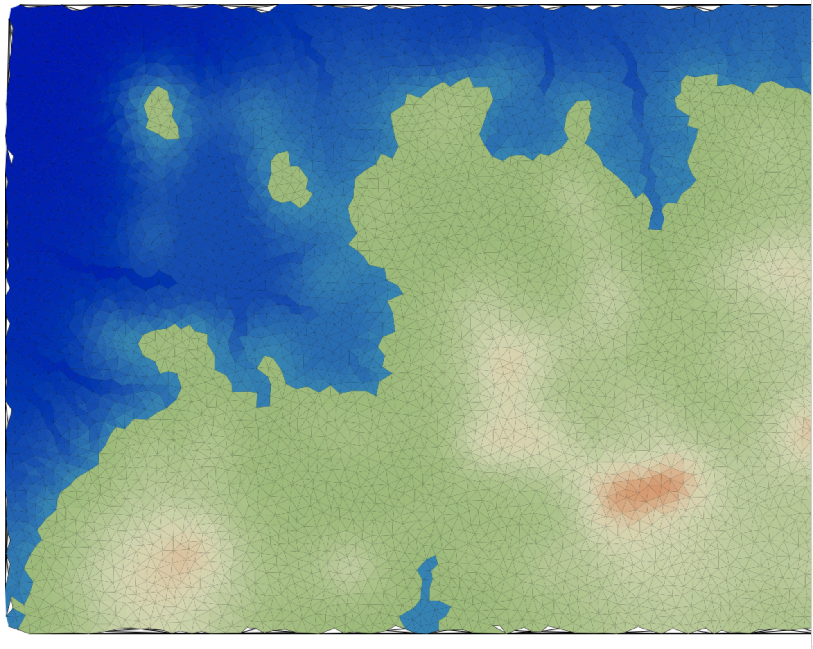

# Goals 

### Short term (in js)
 - Create small continent size maps 
 - Semi-realistic heightmap 
    - mountain ridges 
    - valleys
    - rivers
    
### Eventually (probably move to rust or unity)
 - weather / biomes
    - wind
    - rainfall
    - fertility
 - settlement locations 
 
 
 ### thoughts
 
 Torn between making complex and realistic vs just getting a 
 working version done so I can move on to population / biomes 
  / simulation work.
  
 I really love the idea of making a beautiful map -- including
 tectonics, hotspots, erosion, deposition, sub-sampling for
 finer detail etc. in it. This would be a great project for me 
 over the long term I think, yet I'm also yearning to get my 
 hands dirty in population simulation. 
 
 I think my plan for now will be 
 1. get a workable heightmap by end of week
 2. decide on unity vs rust/browser
  
 
 
    
